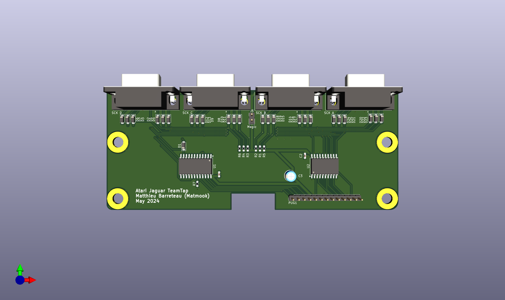
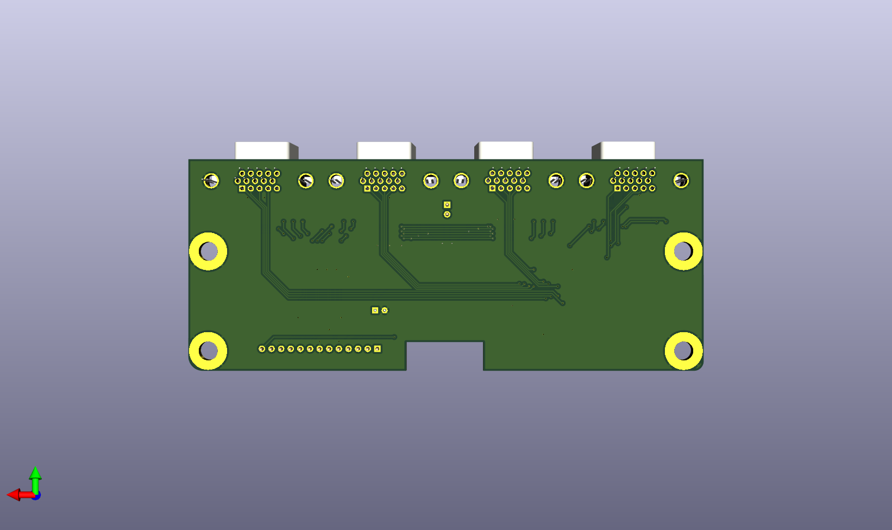

# Atari-Jaguar-TeamTap

This is an attempt to recreate the Atari Jaguar TeamTap schematic.

There is a catch on the original PCB: 
- the 5v from the Jaguar powers TeamTap's internal logic (74HC154 and 74HC244).
- pad's pin 7 is supposed to be used to power the pad's logic (74HC244).
- but all pads pin 7 are left floating in the TeamTam..
I guess that's some Atari magic => the pad's 74HC244 is fed by the other IOs, not VCC.
There is a "Magic" shunt on my pcb to test the pads behaviour when fed with 5v (as it should).

Matthieu Barreteau (Matmook) 2024